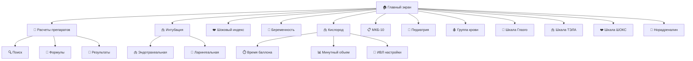

# 🏥 DocHub - Медицинский помощник для врачей и работников скорой помощи

[](https://reactnative.dev/)
[](https://expo.dev/)
[](https://expo.dev/artifacts/eas/t6epoKB5zhD88pCDTeYXKZ.apk)
[](LICENSE)


**DocHub** - профессиональное мобильное приложение для медицинских расчетов и диагностики, разработанное для врачей и медицинского персонала.

## 📋 Оглавление

- [✨ Возможности](#-возможности)
- [🏗️ Архитектура проекта](#️-архитектура-проекта)
- [📱 Карта приложения](#-карта-приложения)
- [🚀 Быстрый старт](#-быстрый-старт)
- [📂 Структура проекта](#-структура-проекта)
- [🛠️ Технологии](#️-технологии)
- [🎨 Дизайн и UI/UX](#-дизайн-и-uiux)
- [📱 Сборка и деплой](#-сборка-и-деплой)
- [🤝 Контрибьютинг](#-контрибьютинг)
- [📄 Лицензия](#-лицензия)

## ✨ Возможности

### 🧮 Медицинские расчеты
- **Расчет дозировок препаратов** - точные дозы для различных лекарств
- **Кислородные расчеты** - определение времени работы баллона, минутного объема дыхания
- **Интубационные расчеты** - размеры эндотрахеальных и ларингеальных трубок
- **Шоковый индекс** - оценка состояния пациента по шкале Алговера

### 🩺 Диагностические инструменты
- **Шкала комы Глазго (GCS)** - оценка уровня сознания
- **Шкала ШОКС** - диагностика сепсиса
- **Шкала вероятности ТЭЛА** - оценка риска тромбоэмболии легочной артерии
- **МКБ-10** - международная классификация болезней с поиском

### 👶 Педиатрия
- **Физиологические нормы** - возрастные нормы для детей
- **Расчеты для детей** - адаптированные формулы для педиатрии

### 🩸 Специализированные модули
- **Группа крови** - определение группы крови
- **Калькулятор беременности** - расчет сроков и параметров
- **Норадреналин** - расчеты для вазопрессорной терапии

## 🏗️ Архитектура проекта

```
DocHub/
├── 📱 Приложение (React Native + Expo)
├── 🎨 UI/UX (адаптивный дизайн)
├── 🔧 Функциональность (медицинские расчеты)
└── 📊 Данные (формулы и нормативы)
```

### Основные принципы:
- **Модульная архитектура** - каждый медицинский инструмент в отдельном модуле
- **React Navigation** - навигация между экранами
- **Responsive Design** - адаптация под разные размеры экранов
- **Accessibility** - поддержка специальных возможностей

## 📱 Карта приложения

```
🏠 ДОМАШНИЙ ЭКРАН
├── 🏥 Медицинские расчеты
│   ├── 💊 Расчет дозировок препаратов
│   │   ├── 🔍 Поиск препаратов
│   │   ├── 📝 Ввод параметров
│   │   └── 🧮 Результаты расчетов
│   └── 📊 Статистика (77 препаратов, мгновенные результаты)
│
├── 🫁 Интубационные расчеты
│   ├── 🫁 Эндотрахеальная трубка
│   └── 👄 Ларингеальная маска
│
├── ❤️ Шоковый индекс Алговера
│   ├── 📝 Параметры пациента
│   └── 📊 Результат оценки
│
├── 👶 Калькулятор беременности
│   ├── 📅 Расчет сроков
│   ├── 🎥 Видео-инструкции
│   └── 📊 Параметры развития
│
└── 🫁 Кислородные расчеты
    ├── ⏱️ Время работы баллона
    ├── 📊 Минутный объем дыхания
    └── 🏥 Настройка аппарата ИВЛ

СПЕЦИАЛИЗИРОВАННЫЕ ИНСТРУМЕНТЫ
├── 📋 МКБ-10 (Международная классификация болезней)
├── 👶 Физиологические нормы в педиатрии
├── 🩸 Определение группы крови
├── 🧠 Шкала комы Глазго
├── 🫁 Шкала вероятности ТЭЛА
├── ❤️ Шкала ШОКС
└── 💉 Норадреналин
```

### Навигационная структура:



## 🚀 Быстрый старт

### Предварительные требования

- **Node.js** >= 18.0.0
- **npm** или **yarn**
- **Expo CLI**
- **Android Studio** (для Android разработки)
- **Xcode** (для iOS разработки, только на macOS)

### Установка

```bash
# Клонирование репозитория
git clone https://github.com/your-username/DocHub.git
cd DocHub

# Установка зависимостей
npm install

# Запуск в режиме разработки
npm start

# Или напрямую для конкретной платформы
npm run android  # для Android
npm run ios      # для iOS
npm run web      # для веб-версии
```

### 📱 Тестирование на устройстве

```bash
# Установка Expo Go на устройство
# iOS: https://apps.apple.com/app/expo-go/id982107779
# Android: https://play.google.com/store/apps/details?id=host.exp.exponent

# Запуск с QR-кодом для сканирования
npm start
```

## 📂 Структура проекта

```
DocHub/
│
├── 📁 main_screen/                 # Главный экран приложения
│   ├── button_app.js              # Компонент главного экрана
│   ├── Icon1.png - Icon7.png      # Иконки для кнопок
│   ├── logo.png                   # Логотип приложения
│   └── title.png                  # Заголовок
│
├── 📁 js_button_preparation/      # Экран медицинских расчетов
│   ├── calculate_button.js        # Основной компонент расчетов
│   ├── formulas.js                # Медицинские формулы
│   ├── Крестик.png               # Иконка закрытия
│   └── Лупа.png                  # Иконка поиска
│
├── 📁 button_two/                 # Интубационные расчеты
│   ├── button_intub/
│   │   ├── IntubationTubeCalculation.js
│   │   └── intub_img.png
│   ├── button_laring/
│   │   ├── LaryngealTubeCalculation.js
│   │   └── ларинг_изображ.png
│   └── navigate_button/
│       ├── TabnavTube.js
│       └── 1.jpeg, 2.jpeg
│
├── 📁 calculate_o2/               # Кислородные расчеты
│   ├── calc_aparat_IVl.js        # Настройка ИВЛ
│   ├── calc_dorbinyn.js          # Минутный объем
│   ├── calc_max_time_o2.js       # Время работы баллона
│   ├── style_oxy.js              # Стили кислородных расчетов
│   └── tabnav_oxy.js             # Навигация кислородных расчетов
│
├── 📁 shock_index_algovera/      # Шоковый индекс
│   ├── shock_algov_app.js
│   └── image2.png
│
├── 📁 pregnancy/                  # Калькулятор беременности
│   └── pregnancy.js
│
├── 📁 Специализированные модули/
│   ├── 📁 mkb10/                  # МКБ-10 классификация
│   │   ├── mkbscreen.js
│   │   └── mkb_data.json
│   ├── 📁 fiz_norm/               # Педиатрические нормы
│   │   └── pediatric_norms_screen.js
│   ├── 📁 blood_group/            # Группа крови
│   │   └── blood_group_screen.js
│   ├── 📁 glazgo/                 # Шкала Глазго
│   │   └── glazgo.js
│   ├── 📁 Tela/                   # Шкала ТЭЛА
│   │   └── tela.js
│   ├── 📁 shoks/                  # Шкала ШОКС
│   │   └── shoks.js
│   └── 📁 Norepinephrine/         # Норадреналин
│       └── NorepinephrineScreen.js
│
├── 📁 css/                        # Стили и темы
│   ├── calculate_preparation/
│   │   ├── calculates_css.js
│   │   └── WelcomeScreenStyles.js
│   ├── main_screen/
│   │   └── styles.js
│   └── [другие стили...]
│
├── 📁 components/                 # Переиспользуемые компоненты
│   └── FontScaling.js            # Компонент масштабирования шрифтов
│
├── 📁 assets/                    # Ресурсы приложения
│   ├── icon.png                  # Иконка приложения
│   ├── splash.png                # Splash screen
│   ├── adaptive-icon.png         # Адаптивная иконка
│   └── [изображения...]
│
├── App.js                        # Главный компонент приложения
├── theme.js                      # Глобальная тема и цвета
├── package.json                  # Зависимости проекта
├── app.json                      # Конфигурация Expo
└── README.md                     # Этот файл
```

## 🛠️ Технологии

### Frontend Framework
- **React Native 0.79.5** - кроссплатформенная разработка
- **Expo SDK 53** - платформа для React Native приложений
- **React 19.0.0** - библиотека пользовательского интерфейса

### Навигация и UI
- **React Navigation 7.x** - навигация между экранами
- **React Native Reanimated 3.x** - анимации и жесты
- **React Native Safe Area Context** - адаптация под безопасные зоны
- **Expo Vector Icons** - иконки для интерфейса

### Специализированные возможности
- **Expo Video** - воспроизведение видео (калькулятор беременности)
- **Expo Clipboard** - работа с буфером обмена
- **React Native Gesture Handler** - обработка жестов
- **Expo Linear Gradient** - градиенты в интерфейсе

### Инструменты разработки
- **Expo CLI** - командная строка Expo
- **Metro** - бандлер React Native
- **Babel** - транспиляция JavaScript
- **EAS Build** - облачная сборка приложений

### Стиль кода
- **ES6+ JavaScript** - современный JavaScript
- **JSX** - синтаксис React
- **StyleSheet** - стилизация React Native
- **Responsive Design** - адаптивный дизайн

## 🎨 Дизайн и UI/UX

### Цветовая палитра
```javascript
// Медицинская цветовая схема
const colors = {
  primary: '#2563EB',        // Синий для основных элементов
  secondary: '#10B981',      // Зеленый для успешных состояний
  danger: '#DC2626',         // Красный для предупреждений
  background: '#FFFFFF',     // Белый фон
  surface: '#F8FAFC',        // Светло-серый для карточек
}
```

### Принципы дизайна
- **Медицинская эстетика** - профессиональный медицинский вид
- **Высокая контрастность** - отличная читаемость
- **Интуитивный интерфейс** - простота использования
- **Адаптивность** - поддержка разных размеров экранов
- **Доступность** - поддержка специальных возможностей

### Анимации и переходы
- **React Native Reanimated** - плавные анимации
- **FadeIn/FadeOut** - эффекты появления
- **Slide transitions** - плавные переходы между экранами
- **Scale animations** - интерактивные эффекты

## 📱 Сборка и деплой

### Локальная разработка
```bash
# Очистка кэша и запуск
npx expo start --clear

# Запуск на конкретном устройстве
npx expo start --android
npx expo start --ios
```


### Сборка для продакшена

#### Android APK
```bash
# Предварительная сборка
npx eas build --platform android --profile preview

# Продакшен сборка
npx eas build --platform android --profile production
```

#### iOS (только на macOS)
```bash
# Предварительная сборка
npx eas build --platform ios --profile preview

# Продакшен сборка
npx eas build --platform ios --profile production
```

### EAS Build конфигурация
```json
// eas.json
{
  "build": {
    "preview": {
      "android": {
        "buildType": "apk"
      }
    },
    "production": {
      "android": {
        "buildType": "aab"
      }
    }
  }
}
```

## 🤝 Контрибьютинг

Мы приветствуем вклад в развитие DocHub! Пожалуйста, следуйте этим шагам:

### Как внести вклад

1. **Форкните репозиторий**
2. **Создайте ветку для вашей фичи**
   ```bash
   git checkout -b feature/amazing-feature
   ```
3. **Зафиксируйте изменения**
   ```bash
   git commit -m 'Add amazing feature'
   ```
4. **Отправьте изменения**
   ```bash
   git push origin feature/amazing-feature
   ```
5. **Создайте Pull Request**

### Руководство по разработке

#### Стиль кода
- Используйте **ES6+** синтаксис
- Следуйте **React Native** best practices
- Используйте **meaningful** названия переменных
- Добавляйте **комментарии** для сложной логики

#### Тестирование
- Тестируйте на **разных устройствах**
- Проверяйте **разные размеры экранов**
- Тестируйте **краевые случаи**
- Валидируйте **медицинские расчеты**

#### Добавление новых функций
1. Создайте **отдельный модуль** для новой функции
2. Добавьте **навигацию** в App.js
3. Обновите **главный экран** (button_app.js)
4. Добавьте **иконку** в assets
5. Обновите **эту документацию**

## 📄 Лицензия

Этот проект распространяется под лицензией MIT. Подробности в файле [LICENSE](LICENSE).

## 👥 Авторы

- **Команда разработки** - Профессиональные разработчики
- **Медицинские консультанты** - Врачи различных специальностей

## 📞 Контакты

- **Email**: govard6981@outlook.com
- **Telegram**: @Ivan_tishe

---

**⚕️ DocHub** - ваш надежный помощник в медицинской практике! 🚀

---

## 🔄 Changelog

### v2.0.0 (Текущая версия)
- ✨ Полный редизайн интерфейса
- 🎨 Новая цветовая схема
- 📱 Улучшенная адаптивность
- 🔧 Оптимизация производительности
- 🆕 Добавлены новые медицинские инструменты

### 📥 Скачать готовое приложение

#### 🚀 Текущая версия: v2.0.0
**Android APK**: [Скачать с Expo](https://expo.dev/artifacts/eas/9MKdaFnSxotn5m1b2zsj3C.apk)

```bash
# Скачать APK напрямую:
curl -L -o DocHub.apk https://expo.dev/artifacts/eas/9MKdaFnSxotn5m1b2zsj3C.apk

# Или собрать самостоятельно:
npx eas build --platform android --profile preview
```

### v1.0.0
- 🚀 Первый релиз
- 🧮 Базовые медицинские расчеты
- 📋 МКБ-10 классификация
- 👶 Педиатрические нормы

---

*Создано с ❤️ для медицинского сообщества*
